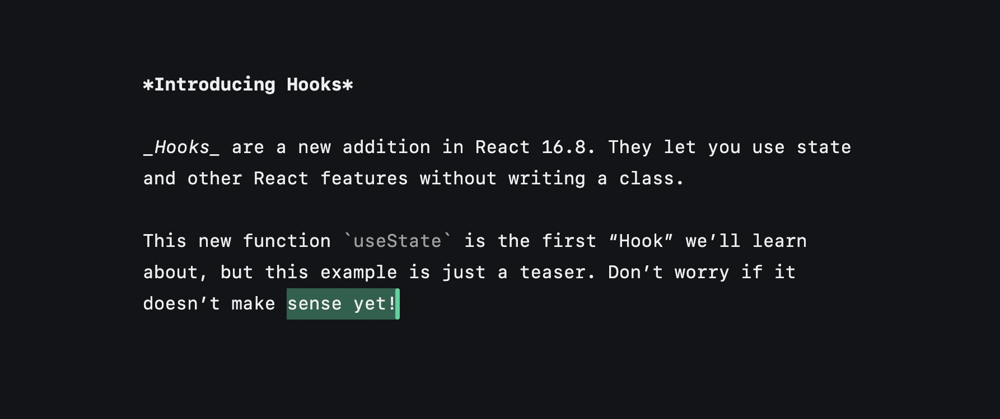

A performant and simple plain text editor, created with Prosemirror. The design is very inpsired by Paco Coursey's ["Writer"](https://github.com/pacocoursey/writer).

The goods:

- Fairly lightweight, around 65.5 kB for the whole website.
  - Can do a fair bit better here...some of the prosemirror modules can be stripped for this purpose.
- Undo/redo.
- Arrow key movement.
- Basic inline markdown (bold, code, italic), although they can be a little buggy.
- JS source is small and readable.
- CSS source is small and readable. Uses CSS variables for styling.
- Accessible and semantic. Each paragraph becomes a `p` tag, each inline style is appropriately styled.
- Pretty (at least I think so, lol).

To run: `npm run dev`. The build step uses `estrella` to bundle/watch and `serve` for serving.

Please hit me up on [twitter](https://twitter.com/moonriseTK) if you like it or wanna see something added!

To do (in priority):

- Basic markdown through Prosemirror marks. Don't remove formatting (WYSIWYG), just style it with the formatting. Just attach attributes to the para tag instead of actually making different blocks. That'll make things easier.
  - Headings
  - Bullet lists
  - Numbered lists
  - Code block
- Use estrella instead of the jank im doing
- Cursor shape changes when marks are applied (fatter when bold, slant when italic, rectangle when code)
- Default word-selection (when you start highlighting, it defaults to selecting the whole word your cursor is on).
- Fix sentence-wrapping bug where it overflows sometimes (unreproducible as of yet, unless you paste in a huge text).
- "Bookmarks" to leave your cursor in a position and travel back to.
- Have an /about page that gets rendered into the editor

Things I'm thinking of adding:

- Table of contents generated from the headings for easy navigation?
- Cursor fades and disappears after a while of inactivity?
- Allow theming/setting the color variables in UI?
- Potentially replace prosemirror-view to be more lightweight and integrate cursor and selection "natively"?
- Urls to share?
